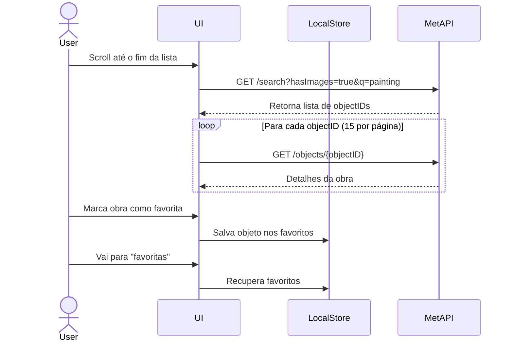

# Art Explorer - Desafio Front-end com React + The Met Museum API

## 🌟 Objetivo

Criar uma aplicação web responsiva utilizando **React**, **TypeScript** e **Node.js** (para o backend), com o objetivo de explorar obras de arte da coleção do Metropolitan Museum of Art (The Met). O sistema deve permitir:

* Buscar obras com imagem
* Visualizar detalhes das obras
* Marcar como favorita
* Listar favoritas

---

## 🔍 Funcionalidades Requeridas

### 1. **Listagem de Obras com Imagem**

* Utilizar a API: `GET /public/collection/v1/search?hasImages=true&q=painting`
* Simular paginação (15 por vez) usando slices do array de `objectIDs`

### 2. **Detalhes de Obra**

* Buscar detalhes de uma obra: `GET /public/collection/v1/objects/{objectID}`
* Exibir: imagem, título, artista, data, técnica, departamento, link para o site oficial

### 3. **Favoritar Obras**

* Botão para marcar/desmarcar favoritos
* Persistir localmente (no browser usando `localStorage` ou `IndexedDB`)

### 4. **Listar Favoritas**

* Seção ou página dedicada para exibir as obras favoritadas

### 5. **Interface Responsiva**

* Design responsivo (preferîncialmente com TailwindCSS ou CSS Modules)
* Scroll infinito ou botão "carregar mais"

---

## 🚀 Stack Tecnológica

* **Frontend:** React + TypeScript + Axios + TailwindCSS (ou equivalente)
* **Backend (opcional):** Node.js + Express (poderá ser usado como proxy de requisições ou para features futuras)

---

## 🔗 Endpoints da API do The Met Museum

| Funcionalidade             | Endpoint                                                           |
| -------------------------- | ------------------------------------------------------------------ |
| Buscar obras com imagens   | `GET /public/collection/v1/search?hasImages=true&q=painting`       |
| Detalhes de uma obra       | `GET /public/collection/v1/objects/{objectID}`                     |
| Buscar por artista/cultura | `GET /public/collection/v1/search?artistOrCulture=true&q=van+gogh` |
| Listar departamentos       | `GET /public/collection/v1/departments`                            |
| Buscar por departamento    | `GET /public/collection/v1/search?departmentId=11&q=portrait`      |

---

## 📊 Requisitos Desejáveis

* Barra de busca com autocomplete
* Filtro por departamento ou artista
* Animações com Framer Motion
* Dark mode
* Deploy (ex: Vercel/Netlify para frontend, Render para backend)

---

## ⌚ Diagrama de Sequência (Mermaid)

---

## 📋 Entrega

Para padronizar a entrega e facilitar a análise:

1. Faça um **fork deste repositório** para sua conta pessoal do GitHub.
2. Crie uma **branch com seu nome em snake_case** (exemplo: `joao_silva_souza`).
3. Suba sua solução utilizando **commits organizados e descritivos**.
4. Após finalizar:
   - Certifique-se de que o repositório esteja **público**
   - Envie o link do seu fork para nossa equipe com:
     - **Título:** `Entrega - joao_silva_souza`
     - **Descrição:** Nome completo, data da entrega e quaisquer observações que julgar relevantes.

> ✅ **Dica**: Você pode incluir um arquivo `THOUGHTS.md` com decisões técnicas, ideias descartadas e sugestões de melhoria.

---

## 📚 Extras

* Pode usar bibliotecas como React Query, Zustand, Redux, etc.
* Não é necessário criar backend se não for preciso, mas é bem-vindo caso deseje mostrar arquitetura completa.
* Bonus: testes com Jest + React Testing Library

---

## 🎓 Licença

Dados públicos da API do The Met sob [CC0 1.0 Universal](https://creativecommons.org/publicdomain/zero/1.0/)

---

## 📢 Contato

* Autor: Leandro Costa
* Email: [leandro@jaya.tech](mailto:leandro@jaya.tech)
